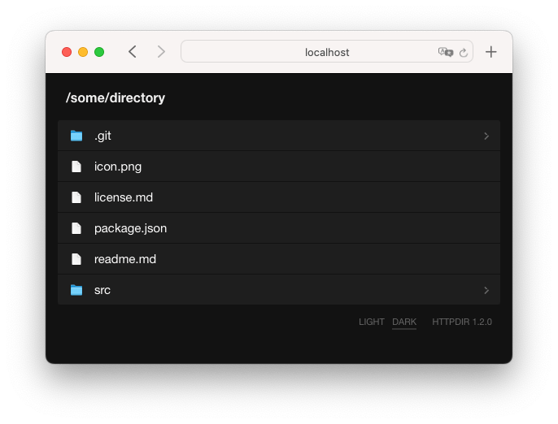

[](https://github.com/johansatge/httpdir/releases)
[](https://www.pkgstats.com/pkg:httpdir)
[](https://github.com/johansatge/httpdir/commits/master)
[](https://github.com/johansatge/httpdir/actions)
[](https://codecov.io/gh/johansatge/httpdir)
[](https://packagephobia.com/result?p=httpdir)


> Simple, zero dependency command-line HTTP server for static local files



---

* [Installation](#installation)
* [Usage](#usage)
  * [CLI](#cli)
  * [Node module](#node-module)
* [Changelog](#changelog)
* [License](#license)

## Installation

_This module needs Node `>=14`._

Install with [npm](https://www.npmjs.com/):

```bash
$ npm install httpdir --global
```

## Usage

### CLI

```bash
httpdir <path> <port>
```

Example:

```bash
# This will start a local server on port `8090`,
# with `~/Desktop` as root directory
httpdir ~/Desktop 8090
```

Default path is `.`, default port is `8080`.

### Node module

Import `httpdir` and create a server:
```js
const httpdir = require('httpdir')
const server = httpdir.createServer({
  basePath: '/some/path', // Optional, default is "."
  httpPort: 9898,         // Optional, default is 8080
})
```
Main events can be listened to:
```js
server.onStart((settings) => {
  console.log('Server started')
  console.log('Base path is:', settings.basePath)
  console.log('Port is:', settings.httpPort)
  console.log('Available URLs:', settings.urls.join(', '))
})
```
```js
server.onStop(() => {
  console.log('Server stopped')
})
```
```js
server.onResponse((response) => {
  console.log('Requested path was:', response.requestedPath)
  console.log('Requested method was:', response.requestedMethod)
  console.log('Response code is:', response.httpCode)
})
```
```js
server.onError((error) => {
  console.log('Server error', error)
})
```
After event listeners have been attached if needed, start the server:
```js
server.start()
```
And stop:
```js
server.stop()
```

## Changelog

This project uses [semver](http://semver.org/).

| Version | Date | Notes |
| --- | --- | --- |
| `2.0.1` | 2023-02-12 | Fix `onResponse` event for favicons |
| `2.0.0` | 2023-02-04 | Expose node module<br>Drop Node 12 support |
| `1.4.0` | 2023-01-29 | Improve startup info |
| `1.3.0` | 2023-01-28 | Support more mime types |
| `1.2.0` | 2022-01-10 | Update UI ([#1](https://github.com/johansatge/httpdir/pull/1)) |
| `1.1.0` | 2021-09-25 | Stop relying on deprecated `url.parse()` |
| `1.0.1` | 2021-07-04 | Fix execution issue on Unix |
| `1.0.0` | 2021-07-04 | Initial version |

## License

This project is released under the [MIT License](license.md).
